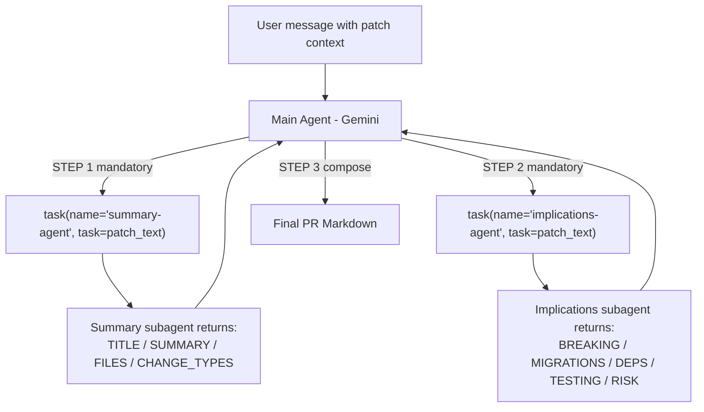

### To run
```bash
uv run goodpr path/to/git/repo --commit-offset 10
```

### How it works


```mermaid
flowchart TD
    User[User message with patch context]
    Main[Main Agent - Gemini]
    SumSub["task(name='summary-agent', task=patch_text)"]
    ImplSub["task(name='implications-agent', task=patch_text)"]
    SumResult["Summary subagent returns:\nTITLE / SUMMARY / FILES / CHANGE_TYPES"]
    ImplResult["Implications subagent returns:\nBREAKING / MIGRATIONS / DEPS / TESTING / RISK"]
    PR[Final PR Markdown]

    User --> Main
    Main -->|"STEP 1 mandatory"| SumSub
    SumSub --> SumResult
    SumResult --> Main
    Main -->|"STEP 2 mandatory"| ImplSub
    ImplSub --> ImplResult
    ImplResult --> Main
    Main -->|"STEP 3 compose"| PR
```


