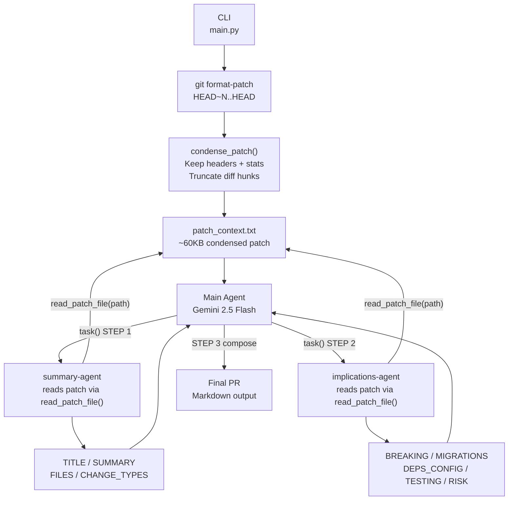

# goodpr

Generate a professional pull request description from a local git repository using LangChain Deep Agents and Gemini.

## Requirements

- Python 3.13+
- [uv](https://docs.astral.sh/uv/)
- A `GOOGLE_API_KEY` for the Gemini API

## Setup

```bash
# Clone and install
uv sync

# Add your Gemini API key
echo GOOGLE_API_KEY=your_key_here > .env
```

## Usage

```bash
uv run goodpr <path/to/repo> --commit-offset <N>
```

| Argument | Description |
|---|---|
| `path/to/repo` | Absolute or relative path to a local git repository |
| `--commit-offset N` | Number of commits back from HEAD to include (default: 5) |
| `--log-file PATH` | Log file path (default: `goodpr.log`) |

**Example** — describe the last 10 commits:

```bash
uv run goodpr C:/projects/myapp --commit-offset 10
```

Output is written to stdout as Markdown, suitable for pasting directly into a GitHub / GitLab PR.

## How it works



### Key design decisions

- **Patch condensation** — `condense_patch()` strips raw diff lines (keeping only 30 per hunk) so the patch stays under DeepAgents' ~80KB context-offload threshold before subagents read it.
- **File-based handoff** — the patch is written to `patch_context.txt` and subagents read it via a `read_patch_file` tool. This avoids asking the main agent to copy hundreds of KB into a `task()` call argument.
- **Structured subagent output** — each subagent returns a fixed labeled format (`TITLE:`, `SUMMARY:`, `BREAKING:`, `RISK:`, etc.) so the main agent can compose the final PR deterministically.
- **Skills** — PR writing guidelines are loaded from `skills/pr/SKILL.md` at runtime.
