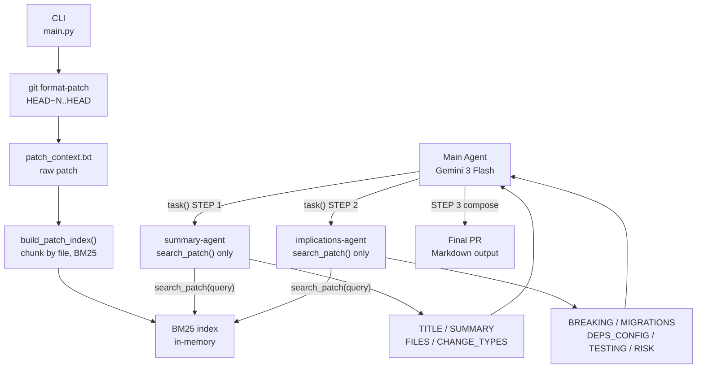

# goodpr

Generate a professional pull request description from a local git repository using LangChain Deep Agents and Gemini.

## Requirements

- Python 3.13+
- [uv](https://docs.astral.sh/uv/)
- A `GOOGLE_API_KEY` for the Gemini API

## Setup

```bash
# Clone and install
uv sync

# Add your Gemini API key
echo GOOGLE_API_KEY=your_key_here > .env
```

## Usage

```bash
uv run goodpr <path/to/repo> --commit-offset <N>
```

| Argument | Description |
|---|---|
| `path/to/repo` | Absolute or relative path to a local git repository |
| `--commit-offset N` | Number of commits back from HEAD to include (default: 5) |
| `--log-file PATH` | Log file path (default: `goodpr.log`) |

**Example** — describe the last 10 commits:

```bash
uv run goodpr C:/projects/myapp --commit-offset 10
```

Output is written to stdout as Markdown, suitable for pasting directly into a GitHub / GitLab PR.

## How it works



### Key design decisions

- **Raw patch on disk** — the full patch is written to `patch_context.txt` (capped at ~500KB from `git format-patch`). Subagents do **not** read this file directly; they only see patch content via search results.
- **BM25 search only** — at startup, the raw patch is chunked per-file-per-commit and indexed with BM25. Subagents use `search_patch(query)` to retrieve relevant chunks (e.g. by file name, function, or keyword) and can analyze the full patch without loading it all at once.
- **File-based handoff** — the patch path is passed in the user message and to `build_pr_agent()` so the BM25 index can be built. After that, all patch access is through the `search_patch` tool, not direct file reads.
- **Structured subagent output** — each subagent returns a fixed labeled format (`TITLE:`, `SUMMARY:`, `BREAKING:`, `RISK:`, etc.) so the main agent can compose the final PR deterministically.
- **Skills** — PR writing guidelines are loaded from `skills/pr/SKILL.md` at runtime.
